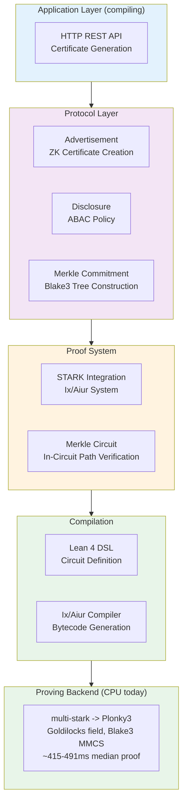

# ZKIP-STARK

[](https://github.com/memmmmike/zkip-stark/actions)
[](LICENSE)
[](https://leanprover.github.io/lean4/)

Zero-Knowledge Intellectual Property Protocol with STARK Proofs

A **research prototype** for privacy-preserving IP metadata exchange. Built with Lean 4 for soundness, powered by STARK proofs via Ix/Aiur -> multi-stark -> Plonky3 (Goldilocks field). The prover's Merkle commitments hash with **Blake3**, run entirely on CPU, and measured proving is fast enough that hardware acceleration was never the bottleneck — the system had simply never been built or benchmarked before. See [Status](#status) below for what actually compiles and runs today.

## Overview

ZKIP-STARK enables verifiable disclosure of intellectual property attributes without revealing sensitive data. The protocol uses Merkle tree commitments and STARK proofs to bind advertised claims to committed data, aiming to prevent attacks like the "Ad-Switch Attack" where malicious actors could advertise different metrics than those committed. See the [Merkle root binding](#security-properties) caveat below — the binding strength as implemented is weaker than "cryptographic" implies.

## Key Features

- **Lean 4 Types**: Core protocol types and the STARK proof path are written and checked in Lean 4; see [Status](#status) for what has been measured
- **STARK Proofs**: Ix/Aiur -> multi-stark -> Plonky3 over the Goldilocks field
- **Blake3 Merkle Commitments**: Tree hashing uses Blake3 (`CoreTypes.lean`), matching the prover's own MMCS — there is no Poseidon hardware path in the working system
- **Measured CPU Baseline**: ~415-491 ms median proof generation, ~42-49 ms verification, on a 12-core desktop CPU with no GPU (see [Performance](docs/performance.md))
- **Batched Disclosure**: K-attribute disclosure under a shared root (`Tests/Validation/BatchDisclosure.lean`)

Recursive proof composition, multi-attribute STARK batching, string-matching optimization, and AI-driven optimization were never implemented — the P0-era scaffolding for these (`RecursiveProofs.lean`, `FullRecursiveVerification.lean`, `Batching.lean`, `StringMatchOptimization.lean`, `AIOptimization.lean`) never compiled and has been deleted. They are future work, not shipped features.

## Architecture

The platform is built on two pillars:

- **Soundness**: Lean 4 formal verification for the parts of the codebase that compile (see [Status](#status))
- **Speed**: STARK proofs via Ix/Aiur -> multi-stark -> Plonky3, hashing with Blake3, CPU-only today. GPU acceleration is planned at the Plonky3 `TwoAdicFriPcs` trait seam (NTT first) — see `docs/superpowers/specs/2026-07-18-gpu-proving-backend-design.md`.



The ZKMB (TLS 1.3 middlebox) application layer was never implemented and its P0-era scaffolding has been deleted — see [Status](#status).

### Core Components

- `STARKIntegration.lean` - Core STARK proof generation and verification
- `MerkleCommitment.lean` - Merkle tree construction (Blake3)
- `MerkleCircuit.lean` - In-circuit Merkle path verification
- `Blake3Circuit.lean` - Blake3 hashing as circuit constraints
- `Api.lean` - HTTP REST API (certificate generation, JSON)
- `Performance.lean` - Performance profiling and metrics

Deleted as non-compiling, never-implemented P0-era scaffolding (see [Status](#status)): `ZKMB.lean` (TLS 1.3 middlebox application), `StringMatchOptimization.lean`, `AIOptimization.lean`, `Batching.lean`, `RecursiveProofs.lean`, `FullRecursiveVerification.lean`, `FRIVerification.lean`, `HashConstraints.lean`, `MerkleReconstruction.lean`, `IrohIntegration.lean`, `NoCapFFI.lean` (vestigial hardware stub, superseded by the pure-Blake3 prover path).

## Requirements

- Lean 4 (v4.24.0 or later)
- Elan (Lean version manager)
- Lake (Lean build system, included with Lean)
- Ix/Aiur STARK system (automatically fetched via Lake)

## Installation

1. Clone the repository:
```bash
git clone https://github.com/yourusername/zkip-stark.git
cd zkip-stark
```

2. Build the project (the `ZkIpProtocol` library target):
```bash
lake build
```

3. Run the tests that actually compile:
```bash
lake exe Tests.STARKTests
lake exe Tests.HashTests
lake exe Tests.Validation.CpuBaseline
lake exe Tests.Validation.ProveVerifyRoundtrip
lake exe Tests.Validation.PredicateSoundness
lake exe Tests.Validation.MerkleScheme
lake exe Tests.Validation.MerkleCircuitSingle
lake exe Tests.Validation.MerkleCircuitPath
lake exe Tests.Validation.MerklePredicate
lake exe Tests.Validation.BatchDisclosure
lake exe Tests.Validation.ScalingStudy
lake exe Tests.Validation.Blake3CircuitSpike
```
See [Status](#status) for the full list of `lean_exe` targets in `lakefile.lean`.

## Quick Start

### Generate a ZK Certificate

```lean
import ZkIpProtocol

-- Create an IP metadata object (Ixon)
let ixon : Ixon := {
  id := 1
  attributes := #[IPAttribute.performance 1000, IPAttribute.security 5]
  merkleRoot := <computed-merkle-root>
  timestamp := <current-timestamp>
}

-- Define a predicate to verify
let predicate : IPPredicate := {
  threshold := 500
  operator := ">="
}

-- Generate certificate with STARK proof
let cert ← generateCertificateWithSTARK ixon predicate privateAttribute ipData attributeIndex
```

### Verify a Certificate

```lean
let isValid ← verifyCertificate cert
if isValid then
  IO.println "Certificate verified successfully"
else
  IO.println "Certificate verification failed"
```

## Project Structure

```
zkip-stark/
├── ZkIpProtocol/          # Core protocol modules
│   ├── CoreTypes.lean     # Shared data structures
│   ├── STARKIntegration.lean  # STARK proof integration
│   ├── MerkleCommitment.lean   # Merkle tree operations
│   ├── MerkleCircuit.lean      # In-circuit Merkle path verification
│   ├── Blake3Circuit.lean      # Blake3 as circuit constraints
│   ├── Advertisement.lean     # Certificate generation
│   └── Api.lean                # HTTP REST API
├── Tests/                 # Test suites (see Status for what compiles)
│   ├── STARKTests.lean
│   ├── HashTests.lean
│   └── Validation/        # CpuBaseline, ProveVerifyRoundtrip, PredicateSoundness,
│                           # MerkleScheme, MerkleCircuit{Single,Path}, MerklePredicate,
│                           # BatchDisclosure, ScalingStudy, Blake3CircuitSpike all compile
└── lakefile.lean          # Build configuration
```

## Technical Details

### Security Properties

- **Ad-Switch Attack Resistance (partial)**: the STARK proof binds the Merkle root as a public input, but as implemented the binding is only **~64 bits strong**, not the full 256-bit Blake3 digest — see the caveat below.
- **Merkle Root Binding — caveat**: `ZkIpProtocol/Api.lean` reduces the Blake3 root to its first 8 bytes (big-endian) and packs that single `u64` into one Goldilocks field element as the public input. This is not the full 256-bit digest; the effective binding strength is ~64-bit, not full-strength cryptographic binding. Recovering the full 256-bit binding would mean spreading the digest across multiple field elements — a protocol change, tracked as follow-up work, not yet done.
- **Termination Guarantees**: recursive functions have verified termination proofs (no `sorry` symbols).

### Performance

Real, measured, no-GPU numbers on an Intel i5-11600K (12 cores, 31 GiB RAM), from `Tests/Validation/CpuBaseline.lean` — full data in `docs/superpowers/notes/2026-07-18-cpu-baseline.md`:

- **Proving**: median 415-491 ms (3-attribute Ixon, ~22k estimated constraints)
- **Verification**: 42-49 ms
- Proofs generated by this harness verify successfully.

There is no hardware bottleneck here — the system had never been built or benchmarked before this measurement. GPU acceleration is planned as future work at the Plonky3 `TwoAdicFriPcs` trait seam (NTT first); see `docs/superpowers/specs/2026-07-18-gpu-proving-backend-design.md`. It is not related to NoCap or Poseidon.

### Optimization Techniques

- **Batched Disclosure**: K-attribute disclosure under a shared Merkle root in a single proof (`Tests/Validation/BatchDisclosure.lean`)
- **Boolean Logic**: Non-zero = True for efficient OR-gates

**Not implemented** (future work; P0-era scaffolding deleted, never compiled): multi-attribute STARK-proof batching, recursive proof composition, string-matching optimization, AI-driven optimization.

## Testing

Run the test suites (all `lean_exe` targets in `lakefile.lean` compile and pass):

```bash
lake exe Tests.STARKTests
lake exe Tests.HashTests
lake exe Tests.Validation.CpuBaseline
lake exe Tests.Validation.ProveVerifyRoundtrip
lake exe Tests.Validation.PredicateSoundness
lake exe Tests.Validation.MerkleScheme
lake exe Tests.Validation.MerkleCircuitSingle
lake exe Tests.Validation.MerkleCircuitPath
lake exe Tests.Validation.MerklePredicate
lake exe Tests.Validation.BatchDisclosure
lake exe Tests.Validation.ScalingStudy
lake exe Tests.Validation.Blake3CircuitSpike
lake exe Tests.Validation.MerkleNodeHashSpike
```

The P0-era non-compiling test exes that used to live here (`ProtocolTests`, `BatchingTests`, `ApiTests`, `ZKMBTests`, `MinimalCircuitTest`, `Validation.MasterValidation`, `Validation.SoundnessTests`, `Validation.STARKRoundTripTests`, `Validation.ThroughputBenchmarks`, `Validation.ZKMBLatencyTests`, `Validation.RecursiveStabilityTests`) referenced fictional APIs or stale struct fields, never compiled, and have been deleted.

## Dependencies

- **Ix/Aiur**: STARK proof system (https://github.com/argumentcomputer/ix), which pulls in multi-stark and Plonky3 (Goldilocks field, Blake3 MMCS)
- **Lean 4**: Formal verification framework

## Documentation

For detailed documentation, see:
- Architecture overview: `docs/architecture.md`
- Performance: `docs/performance.md`
- CPU baseline data: `docs/superpowers/notes/2026-07-18-cpu-baseline.md`
- GPU proving backend design (planned work): `docs/superpowers/specs/2026-07-18-gpu-proving-backend-design.md`

## Contributing

Contributions are welcome! Please ensure:
- Code you touch compiles (`lake build` for the library; the affected `lean_exe` target for tests)
- No new `sorry` symbols in proofs
- The tests listed under [Testing](#testing) still pass
- Code follows Lean 4 style guidelines

## License

Licensed under the Apache License, Version 2.0. See [LICENSE](LICENSE) for details.

## Status

**Research prototype, not production-ready.** The `ZkIpProtocol` library default target and all `lean_exe` targets in `lakefile.lean` compile and pass — see [Testing](#testing) for the full list. Proofs generated on that path verify, with a measured CPU baseline (see [Performance](#performance)) and the Merkle-root binding caveat noted under [Security Properties](#security-properties).

The P0-era, never-compiling scaffolding for a TLS 1.3 zero-knowledge middlebox (`ZKMB.lean`), string-matching optimization (`StringMatchOptimization.lean`), AI-driven optimization (`AIOptimization.lean`), recursive proof composition (`RecursiveProofs.lean`, `FullRecursiveVerification.lean`, `FRIVerification.lean`, `HashConstraints.lean`, `MerkleReconstruction.lean`), STARK-proof batching (`Batching.lean`), Iroh network integration (`IrohIntegration.lean`), and the vestigial hardware FFI stub (`NoCapFFI.lean`) referenced fictional APIs or stale struct fields, never compiled, and have been deleted from the repository. They are **not implemented** — treat any performance claim they used to imply (sub-3ms ZKMB latency, "586x NoCap speedup" throughput targets, constant ~162 KB recursive proof size) as unverified future work, not a shipped feature.

## References

- Ix/Aiur STARK System: https://github.com/argumentcomputer/ix
- Zero-Knowledge Middlebox (background reading; the ZKMB application described here was never implemented in this repo): https://www.usenix.org/system/files/sec22-grubbs.pdf
